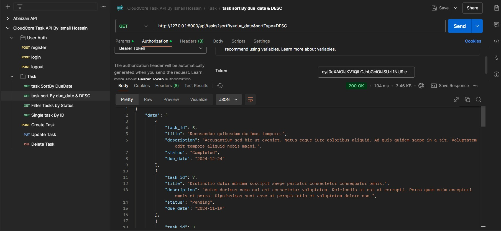

## About Project

In this Task management system I developed only backend, I added "CloudCore Task API By Ismail Hossain.postman_collection.json" file inside public folder and attached in email also.
I used Passport for user Authentication. And added all provable request for auth and TASH CRUD, Filter in attached postman json file.
you can check all just import attached "CloudCore Task API By Ismail Hossain.postman_collection.json" file in your Postman .

Please Follow Steps:

- If you got ,{"status":"Error","message":"Personal access client not found. Please create one.","data":null}
please run "php artisan passport:client --personal".

Laravel is accessible, powerful, and provides tools required for large, robust applications.

## Provable Error
- Error: Internal Server Error
       Symfony\Component\Routing\Exception\RouteNotFoundException
       Route [login] not defined.
- Solution: set bearer token properly

## Some demo image
## Some Demo Images

### Register User

### Sort By due_date

### Tasks By Filter

