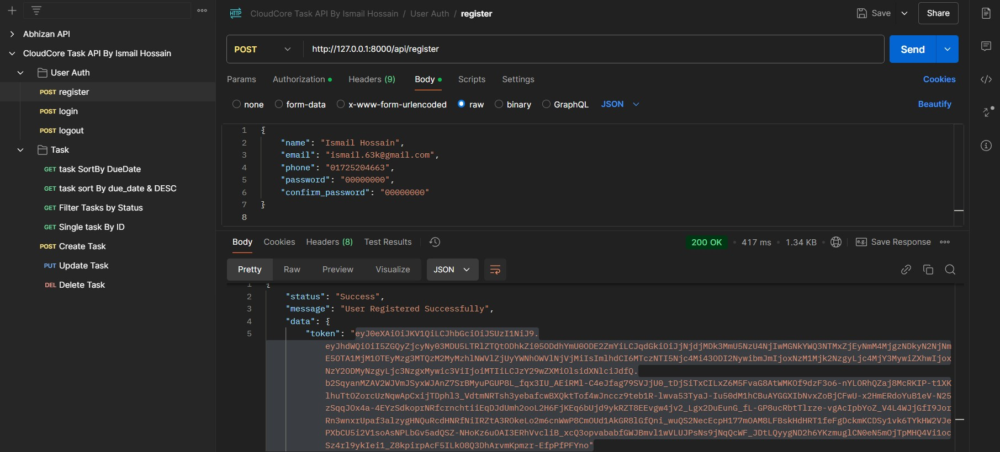

<p align="center"><a href="https://laravel.com" target="_blank"></a></p>

# Task Management System

This Task Management System backend is built using Laravel. Below are the details and instructions for testing and running the application. I used Passport for user Authentication, also added all request url and required data as JSON format for auth, Task CRUD and Filter in attached postman json file.
You can test all, just import attached API Collections in your Postman .

## Features
- User Authentication using Laravel Passport
- Task CRUD operations
- Task filtering
- Dummy data seeding

## Getting Started

### 1. Clone the repository:
```bash
 git clone https://github.com/ismail306/cloudcore-task_management_system-with_APIs.git
 cd cloudcore-task_management_system-with_APIs
```

### 2. Copy the example environment file and configure it:
```bash
 cp .env.example .env
```

### 3. Install dependencies:
```bash
composer update
 ```

### 4. Configure the `.env` file:
- Update database credentials to match your local setup:
 ```env
DB_DATABASE=your_database_name
DB_USERNAME=your_database_user
DB_PASSWORD=your_database_password
```
### 5. Start the Laravel development server:
 ```bash
 php artisan serve
 ```
---

### 2. Database Setup

#### Option 1: Use Seeders
Run the seeders to insert dummy data for users, tasks, and the Passport personal access token:
```bash
php artisan db:seed
```

#### Option 2: Import SQL File

Alternatively, you can import the provided SQL file to set up the database:

- [task-management-db-ismail.sql](task-management-db-ismail.sql)


## Testing Instructions

1. Ensure the database is configured and populated with dummy data (via seeders or the SQL file).
2. Import the attached Postman APIs collection into Postman to test Task CRUD operations and filtering
- [CloudCore Task API by Ismail Hossain.postman_collection.json](public/CloudCore%20Task%20API%20By%20Ismail%20Hossain.postman_collection.json)


---

## Authentication

The project uses Laravel Passport for secure user authentication. Below are the key points:

1. Use the Postman collection to authenticate and retrieve the access token. Include the token in the request headers as:
    ```
    Authorization: Bearer <your-access-token>
    ```
2. Refer to the Postman collection for details on:
    - Authentication endpoints
    - Request payloads
    - Header requirements

Once authenticated, you can access all the authenticated routes and perform CRUD operations on tasks.


## Probable Error ⚠️
If you send a request for any operation from Postman without or with a wrong bearer token, you may encounter the following error:

- ⚠️ **Error: Internal Server Error**  
  `Symfony\Component\Routing\Exception\RouteNotFoundException`  
  `Route [login] not defined.`

### Solution:
Set the bearer token properly in your POSTMAN:
- **Authorization > Auth Type > Select Bearer Token > Paste responded Token.**  
<span style="color: green;">_I will handle this more gracefully in future updates._</span>


## Some Demo 

### Register User


### Sort By due_date


### Filter Tasks By Status


